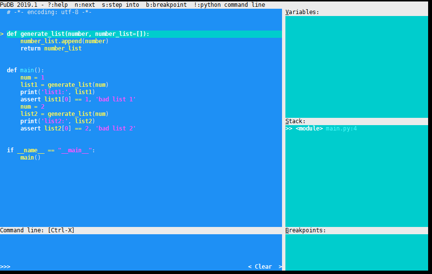
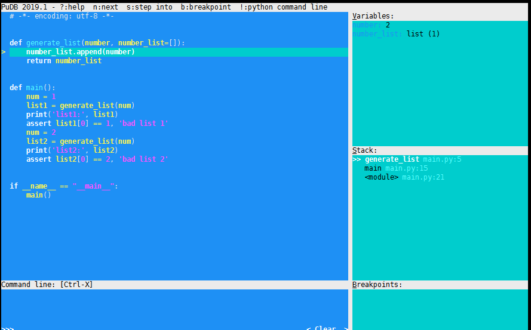
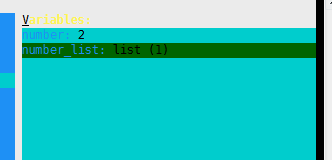
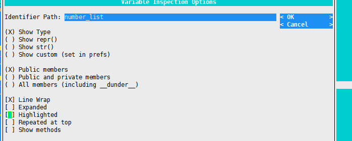
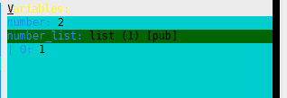
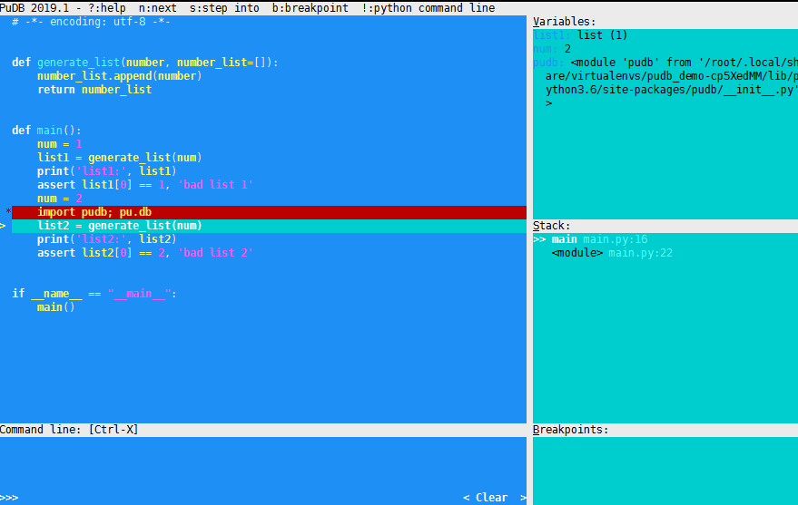
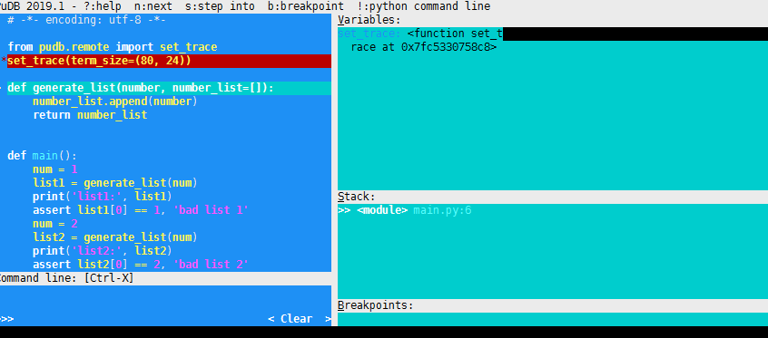
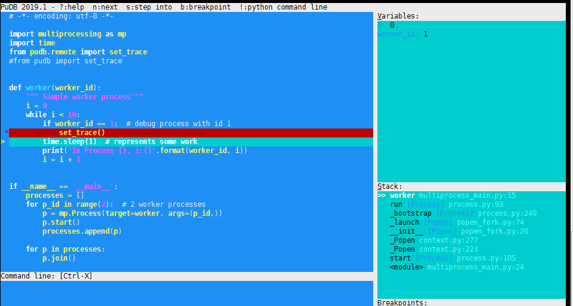

# pudb

PuDB is a full-screen, console-based visual debugger for Python. 相对于pdb更加容易使用. 下面整理一下pudb的使用，在需要用的时候当做一个参考.


## 安装

```
pip install pudb
```


## 基本使用

#### 不设置断点方式

```
python -m pudb main.py
```

如图,光标指向了第一行.  因为没有设置断点,直接从第一行开始调试运行.



从界面上可以看到几个信息:

- **n**: 往下执行
- **s**:进入,比如进入函数
- **b**: 设置断点
- **!**:进入python交互模式,比如可以打印当前上下文的变量等. `ctrl+d`返回到调试模式.
- **Variables**: 当前堆栈变量
- **Stack**: 调用栈
- **Breakpoints**:断点
- **q**: 退出, 出现退出界面再按一次`q`就退出了.


例子中代码如下:

```python
def generate_list(number, number_list=[]):
    number_list.append(number)
    return number_list

def main():
    num = 1
    list1 = generate_list(num)
    print('list1:', list1)
    assert list1[0] == 1, 'bad list 1'
    num = 2
    list2 = generate_list(num)
    print('list2:', list2)
    assert list2[0] == 2, 'bad list 2'

if __name__ == "__main__":
    main()

```

函数`generate_list`会根据传入的参数返回一个包含着参数的列表. 下面运行一下看看效果:

```shell
(pudb_demo-cp5XedMM) root@env-monitor-5-2-5:/opt/pudb_demo# python  main.py 
list1: [1]
list2: [1, 2]
Traceback (most recent call last):
  File "main.py", line 21, in <module>
    main()
  File "main.py", line 17, in main
    assert list2[0] == 2, 'bad list 2'
AssertionError: bad list 2

```

竟然出错了。。。因为缺少上下文,所以直接看不出错误. 这下改我们的调试帮手`pudb`上手了.

运行`python  -m pudb main.py `,会出现上面图中那样. 我们输入`n`、`s`等命令一步步看在这里停下来:

```python
list2 = generate_list(num)
```

输入`s`进入函数,如图:



奇怪,`number_list.append(number)`这一行还未执行, `number_list`竟然已经有一个值了. 明明参数上通过`number_list=[]`设置空了. 到目前为止,根据调试找到了错误的位置.  现在一共有两个问题要解决:

1. 右边`Variables`只显示了`number_list`参数个数,要是能显示内容就好了.
2. `number_list=[]`为啥不生效.

下面来解答这两个问题:

1. 通过键盘`->`键可以将光标移到`Variables`,再上下选择`number_list`变量. 如图:

   输入回车,可以看到对变量展示的一个配置给`Expanded`打钩,然后保存.如图:
   
   现在已经看到`number_list`具体值了.

2. 在python里,如果将字典或列表作为函数的参数, 函数第一次调用的时候,python会创建一个持久对象(persistent object ),后面再次调用的时候使用的是同一个对象. 打印对象id可以看出`list1`和`list2`是一样的.

#### 设置断点方式

可以直接在错误的地方加断点. 

```
from pudb import set_trace; set_trace()
or
import pudb; pu.db
```

这里在`list2 = generate_list(num)`上一行加断点. 有断点就不需要`python -m pudb`方式了, 直接`python main.py`就可以了,如图:



然后就可以像上面那样调试了.

## 分离调试窗口

当我们在一个窗口里调试时, 是看不到程序的输出的.  `pudb`可以通过如下方式实现在新的窗口显示调试时程序的输出. 假设现在两个窗口:窗口A和窗口B.  我们要进行调试的窗口是窗口 B.

- 查看窗口B的tty, 输入`tty`命令,例如我的是`/dev/pts/4`
- 在窗口 B执行`perl -MPOSIX -e pause`,目的是不让`pudb`有任何输入,要不调试时会错乱.
- 在窗口A执行`PUDB_TTY=/dev/pts/4 python -m pudb main.py`
- 切换到窗口B进行实际的调试. 调试过程可以看到输出语句会打印在窗口A里.

## 远程调试

首先需要在代码里加上

```python
from pudb.remote import set_trace
set_trace(term_size=(80, 24))
```

比如现在有窗口A和窗口 B.

- 在窗口A启动,例如:

  ```shell
  (pudb_demo-cp5XedMM) root@env-monitor-5-2-5:/opt/pudb_demo# python main.py 
  pudb:6899: Please telnet into 127.0.0.1 6899.
  pudb:6899: Waiting for client...
  ```

- 在窗口B执行

  ```shell
  telnet 127.0.0.1 6899
  ```

  如图:

如果需要在其他机器访问,需要这样启动:

```shell
PUDB_RDB_HOST=0.0.0.0 python  main.py
```

## 多进程调试

有时我们的程序会启动进程去做一些事情. 在多进程模式下,如果普通方式设置断点，例如:

```python
from pudb import set_trace; set_trace()
```

启动时会出现如下错误:

```python
    return self._getch(0)
  File "/root/.local/share/virtualenvs/pudb_demo-cp5XedMM/lib/python3.6/site-packages/urwid/raw_display.py", line 554, in _getch
    return ord(os.read(self._term_input_file.fileno(), 1))
TypeError: ord() expected a character, but string of length 0 found
```

正确的方式是利用远程调试.  执行如下命令:

```shell
PUDB_RDB_HOST=0.0.0.0 python multiprocess_main.py
```

在远程机器运行:

```shell
telnet x.x.x.x 6899
```

如图:



就好像在一个进程里调试一样,剩余的进程该做什么做什么，互不影响.


## 参考

- [**官方文档 **](https://documen.tician.de)
- [Use puDB to Debug Python Multiprocessing Code](https://medium.com/@auro_227/use-pudb-to-debug-python-multiprocessing-code-c0c5551d010c)
- [Using a mutable default value as an argument](https://docs.quantifiedcode.com/python-anti-patterns/correctness/mutable_default_value_as_argument.html)

